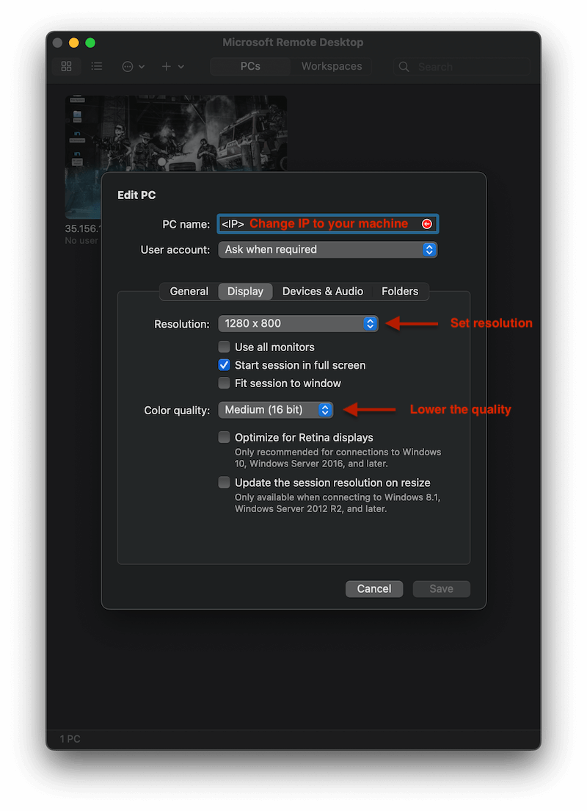
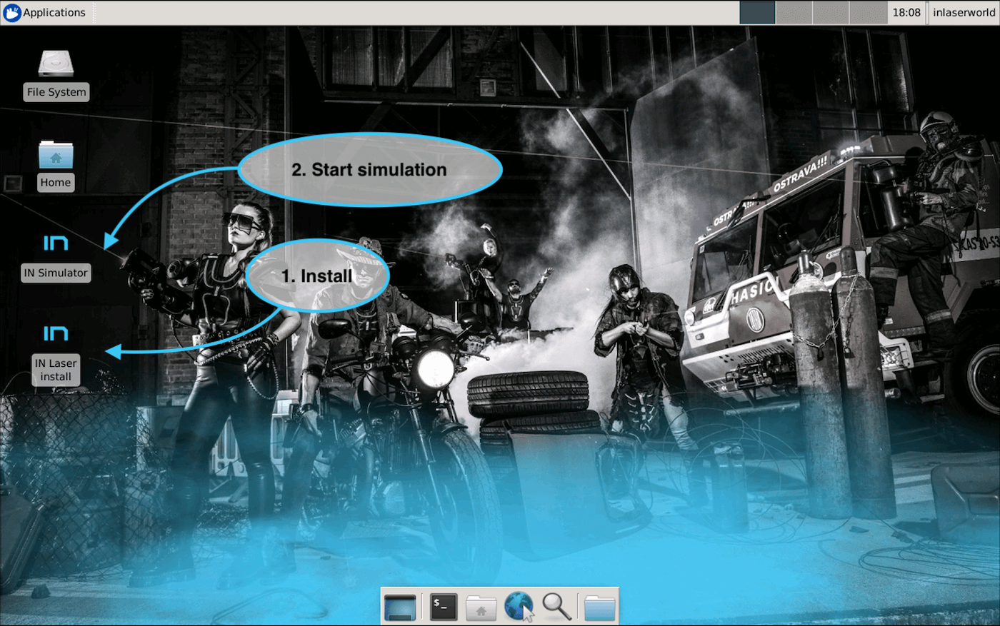
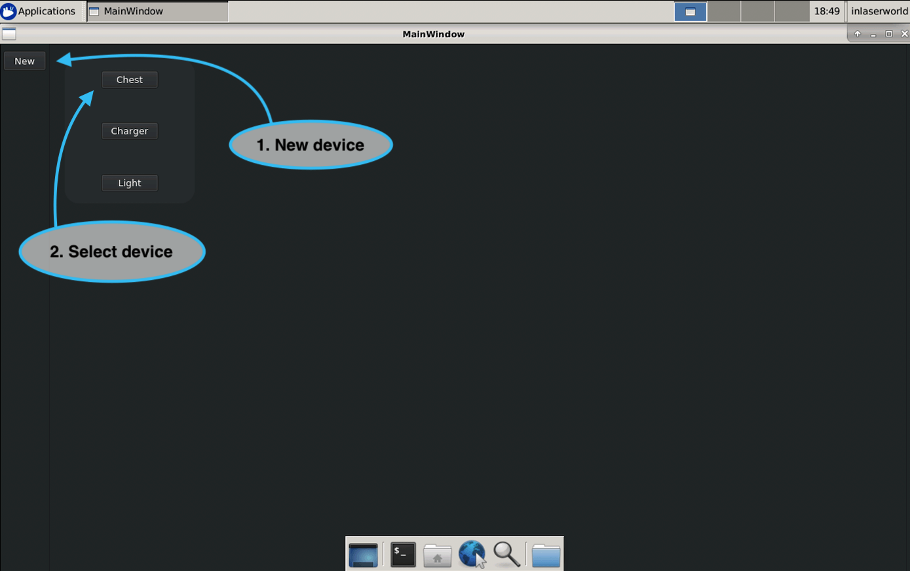
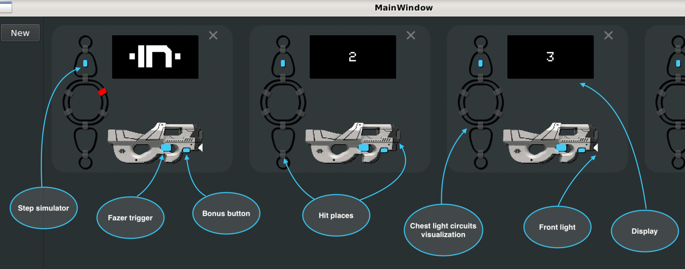
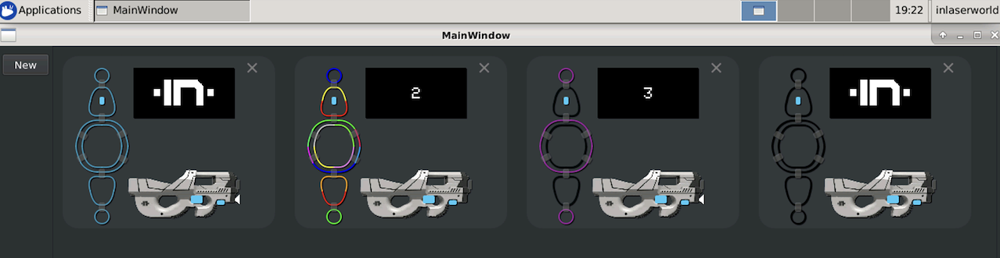

## Simulation get started

To connect simulation the standard RDP can be used. This guide will show it on MAC OS using 
microsoft remote desktop application. To get the best performance use resolution 1280x800 and lower the color
quality. On windows there is native remote desktop and on linux remmina could be used.

Than connect it. The credentials are:
- username: **inlaserworld**
- password: **inlaserworld** (It is recommended to change password using ```passwd``` later)

First double-click on install. During installation email will be required used for default admin user.
Once installation is done continue with start simulation.



Then add new device and select chest. This will create full simulation of real hardware device.



Then next picture describes chest device its action buttons and visualization elements.



Just a showcase of chest device presentation mode. Note: segments on real device creates really nice
effects :) 


